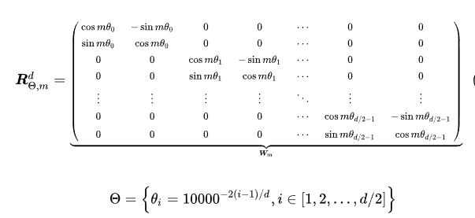
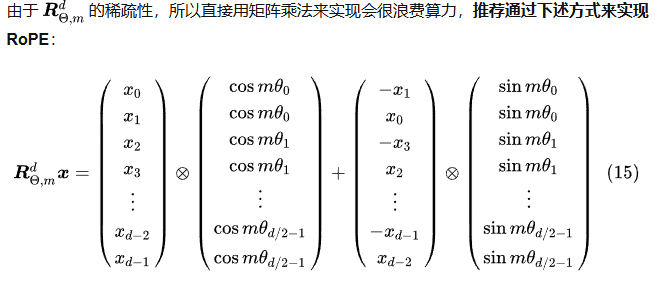
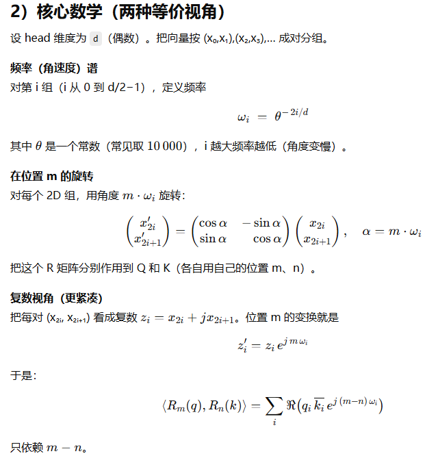

# RMS_Norm

对每个值进行缩放，原理就是先计算所有值的平方和，在取平均，在取平方根，然后所有值来除以这个结果。

```python
class RMSNorm(torch.nn.Module):
    def __init__(self, dim: int, eps: float = 1e-5):
        super().__init__()
        self.eps = eps
        self.weight = nn.Parameter(torch.ones(dim))

    def _norm(self, x):
        return x * torch.rsqrt(x.pow(2).mean(-1, keepdim=True) + self.eps)

    def forward(self, x):
        return self.weight * self._norm(x.float()).type_as(x)
```


# RoPE

参考阅读：
https://www.zhihu.com/tardis/bd/art/647109286
https://zhuanlan.zhihu.com/p/642884818

本质就是欧拉公式讲$e^{im\theta}$转为复数 $cos({m\theta})+i\space sin({m\theta})$，然后讲q和v转为复数形式，相乘后，发现就是旋转矩阵。





torch.outer是计算两个矩阵的外积，是向量中的每一个元素与另外一个向量中的每一个元素相乘，结果不是一个标量，而是一个矩阵。  

torch.arange(start, end, step)，生成从start到end的步长为step的range  

torch.polar(abs, angle, \*, out=None)。 $out = abs*cos(angle) + i*sin(angle)$ 

LLaMA的实现是按照转为欧拉公式后按照复数相乘的思路来的，最贴近论文提出的原本的方法。

```python
# 生成旋转矩阵
def precompute_freqs_cis(dim: int, seq_len: int, theta: float = 10000.0):
    # 计算词向量元素两两分组之后，每组元素对应的旋转角度\theta_i
    freqs = 1.0 / (theta ** (torch.arange(0, dim, 2)[: (dim // 2)].float() / dim))
    # 生成 token 序列索引 t = [0, 1,..., seq_len-1]
    t = torch.arange(seq_len, device=freqs.device)
    # freqs.shape = [seq_len, dim // 2] 
    freqs = torch.outer(t, freqs).float()  # 计算m * \theta

    # 计算结果是个复数向量
    # 假设 freqs = [x, y]
    # 则 freqs_cis = [cos(x) + sin(x)i, cos(y) + sin(y)i]
    freqs_cis = torch.polar(torch.ones_like(freqs), freqs) 
    return freqs_cis

# 旋转位置编码计算
def apply_rotary_emb(
    xq: torch.Tensor,
    xk: torch.Tensor,
    freqs_cis: torch.Tensor,
) -> Tuple[torch.Tensor, torch.Tensor]:
    # xq.shape = [batch_size, seq_len, dim]
    # xq_.shape = [batch_size, seq_len, dim // 2, 2]
    # 将最后一维分成两个一对的维度
    xq_ = xq.float().reshape(*xq.shape[:-1], -1, 2)
    xk_ = xk.float().reshape(*xk.shape[:-1], -1, 2)
    
    # 转为复数域
    xq_ = torch.view_as_complex(xq_)
    xk_ = torch.view_as_complex(xk_)
    
    # 应用旋转操作，然后将结果转回实数域
    # xq_out.shape = [batch_size, seq_len, dim]
    xq_out = torch.view_as_real(xq_ * freqs_cis).flatten(2)
    xk_out = torch.view_as_real(xk_ * freqs_cis).flatten(2)
    return xq_out.type_as(xq), xk_out.type_as(xk)
```

minimind的实现则是分别计算cos和sin，即上面第二个图片演示的方法计算

```python
def precompute_freqs_cis(dim: int, end: int = int(32 * 1024), theta: float = 1e6):
    freqs = 1.0 / (theta ** (torch.arange(0, dim, 2)[: (dim // 2)].float() / dim))
    t = torch.arange(end, device=freqs.device)
    freqs = torch.outer(t, freqs).float()
    freqs_cos = torch.cat([torch.cos(freqs), torch.cos(freqs)], dim=-1)
    freqs_sin = torch.cat([torch.sin(freqs), torch.sin(freqs)], dim=-1)
    return freqs_cos, freqs_sin


def apply_rotary_pos_emb(q, k, cos, sin, position_ids=None, unsqueeze_dim=1):
    def rotate_half(x):
        return torch.cat((-x[..., x.shape[-1] // 2:], x[..., : x.shape[-1] // 2]), dim=-1)

    q_embed = (q * cos.unsqueeze(unsqueeze_dim)) + (rotate_half(q) * sin.unsqueeze(unsqueeze_dim))
    k_embed = (k * cos.unsqueeze(unsqueeze_dim)) + (rotate_half(k) * sin.unsqueeze(unsqueeze_dim))
    return q_embed, k_embed
```



预计算频率与正余弦表

```python
import torch

def rope_angles(seq_len, head_dim, theta=10000.0, device=None, dtype=torch.float32):
    assert head_dim % 2 == 0
    half = head_dim // 2
    # 频率：theta^(-2i/d)
    inv_freq = theta ** (-torch.arange(0, half, device=device, dtype=dtype) * 2.0 / head_dim)
    # 角度表：pos[:, None] * inv_freq[None, :]
    pos = torch.arange(seq_len, device=device, dtype=dtype)
    ang = pos[:, None] * inv_freq[None, :]  # [seq, half]
    cos, sin = ang.cos(), ang.sin()
    return cos, sin  # 各是 [seq, half]

```

**把 RoPE 应用到 Q/K**（形状 `[batch, seq, heads, head_dim]`）

```python
def apply_rope(x, cos, sin, pos_offset=0):
    # x: [B, S, H, D]; cos/sin: [S_total, D/2]
    B,S,H,D = x.shape
    half = D // 2
    x = x.view(B, S, H, half, 2)
    x1, x2 = x[..., 0], x[..., 1]           # 各 [B,S,H,half]
    cos_t = cos[pos_offset:pos_offset+S].view(1,S,1,half)
    sin_t = sin[pos_offset:pos_offset+S].view(1,S,1,half)
    # 2D 旋转
    y1 = x1 * cos_t - x2 * sin_t
    y2 = x1 * sin_t + x2 * cos_t
    return torch.stack([y1, y2], dim=-1).reshape(B, S, H, D)

```


# grouped-query attention

```python
def repeat_kv(x: torch.Tensor, n_rep: int) -> torch.Tensor:
    """torch.repeat_interleave(x, dim=2, repeats=n_rep)"""
    bs, slen, num_key_value_heads, head_dim = x.shape
    if n_rep == 1:
        return x
    return (
        x[:, :, :, None, :]
        .expand(bs, slen, num_key_value_heads, n_rep, head_dim)
        .reshape(bs, slen, num_key_value_heads * n_rep, head_dim)
    )
```


代码讲解

-   x[:, :, :, None, :] # 在维度2和3之间插入新维度 相当于x.unsqueeze(3)
-   tensor.expand 将新维度从1扩展到n_rep, 零拷贝操作，不会实际复制数据，只是创建视图

```python
# 更直观但低效的实现
def repeat_kv_simple(x, n_rep):
    if n_rep == 1:
        return x
    return x.repeat(1, 1, n_rep, 1)
    
# 使用repeat_interleave的实现
def repeat_kv_interleave(x, n_rep):
    return torch.repeat_interleave(x, n_rep, dim=2)
```


# 有attention mask的attention计算

```python
scores = (xq @ xk.transpose(-2, -1)) / math.sqrt(self.head_dim)
            scores = scores + torch.triu(
                torch.full((seq_len, seq_len), float("-inf"), device=scores.device),
                diagonal=1
            ).unsqueeze(0).unsqueeze(0)  # scores+mask

if attention_mask is not None:
    extended_attention_mask = attention_mask.unsqueeze(1).unsqueeze(2)
    extended_attention_mask = (1.0 - extended_attention_mask) * -1e9
    scores = scores + extended_attention_mask
```


# MoE

一个专家就是一个神经网络模块，通常就是MLP
经过一个transformer block后，会有一个MoEGate。MoEGate接收x(batch, seq_len, hidden_dim)，然后生成routered_expert的概率，选择topk，然后经过这下expert后求加权和（根据前面的gate概率），再和shared_expert的输出结果相加。

