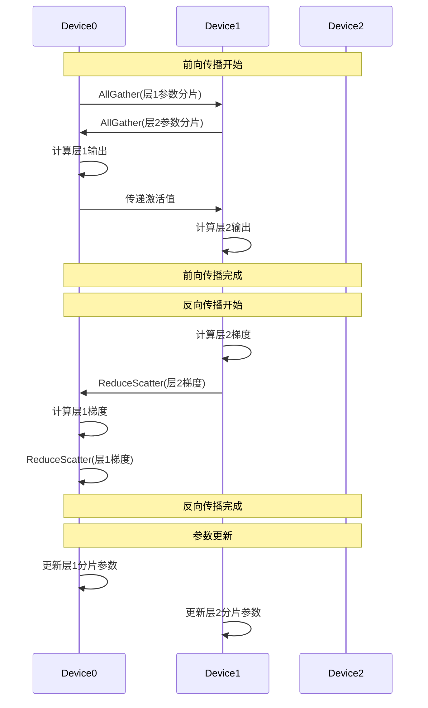
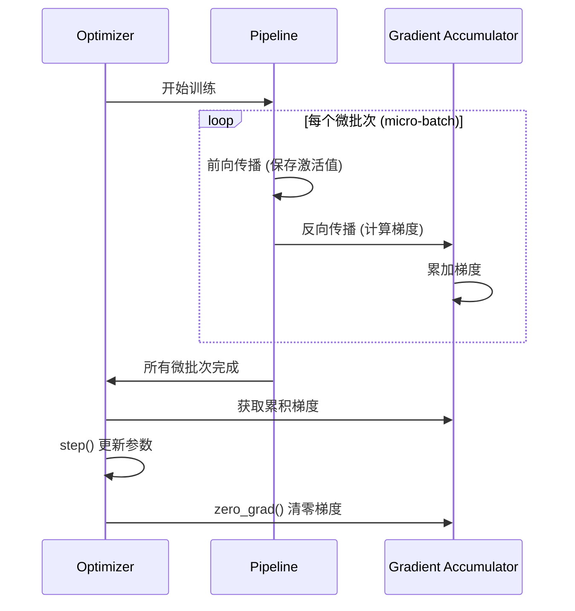

# 引言

Data Parallelism is a widely adopted single-program multiple-data training paradigm where the model is replicated on every process, every model replica computes local gradients for a different set of input data samples, gradients are averaged within the data-parallel communicator group before each optimizer step.

Model Parallelism techniques (or Sharded Data Parallelism) are required when a model doesn’t fit in GPU, and can be combined together to form multi-dimensional (N-D) parallelism techniques.

When deciding what parallelism techniques to choose for your model, use these common guidelines:

1.  Use [DistributedDataParallel (DDP)](https://pytorch.org/docs/stable/notes/ddp.html), if your model fits in a single GPU but you want to easily scale up training using multiple GPUs.
    -   Use [torchrun](https://pytorch.org/docs/stable/elastic/run.html), to launch multiple pytorch processes if you are using more than one node.
    -   See also: [Getting Started with Distributed Data Parallel](https://docs.pytorch.org/tutorials/intermediate/ddp_tutorial.html)
2.  Use [FullyShardedDataParallel (FSDP2)](https://pytorch.org/docs/stable/distributed.fsdp.fully_shard.html) when your model cannot fit on one GPU.
    -   See also: [Getting Started with FSDP2](https://pytorch.org/tutorials/intermediate/FSDP_tutorial.html)
3.  Use [Tensor Parallel (TP)](https://pytorch.org/docs/stable/distributed.tensor.parallel.html) and/or [Pipeline Parallel (PP)](https://pytorch.org/docs/main/distributed.pipelining.html) if you reach scaling limitations with FSDP2.
    -   Try our [Tensor Parallelism Tutorial](https://pytorch.org/tutorials/intermediate/TP_tutorial.html)
    -   See also: [TorchTitan end to end example of 3D parallelism](https://github.com/pytorch/torchtitan)

DP->DDP->FSDP

MP(model parallel)->PP

TP

# DDP

accelerator库默认DDP

多个进程，每个进程有一个model 的instance

会同步多个进程的梯度和buffer

原理是registers an autograd hook for each parameter in the model. When the backward pass is run, this hook fires and triggers gradient synchronization across all processes.  This ensures that each process has the same gradients, which are then used to update the model.

## Comparison between `DataParallel` and `DistributedDataParallel`

Before we dive in, let’s clarify why you would consider using `DistributedDataParallel` over `DataParallel`, despite its added complexity:

-   First, `DataParallel` is single-process, multi-threaded, but it only works on a single machine. In contrast, `DistributedDataParallel` is multi-process and supports both single- and multi- machine training. Due to GIL contention across threads, per-iteration replicated model, and additional overhead introduced by scattering inputs and gathering outputs, `DataParallel` is usually slower than `DistributedDataParallel` even on a single machine.
-   Recall from the [prior tutorial](https://pytorch.org/tutorials/intermediate/model_parallel_tutorial.html) that if your model is too large to fit on a single GPU, you must use **model parallel** to split it across multiple GPUs. `DistributedDataParallel` works with **model parallel**, while `DataParallel` does not at this time. When DDP is combined with model parallel, each DDP process would use model parallel, and all processes collectively would use data parallel.

其中model parallel就是分割一下，调用to方法，分在不同的device上。

示例代码：

其中主要训练的部分不需要怎么改，需要用`DistributedDataParallel`包装model

除此之外，还需要在dataloader加上sampler

```python
import torch
import torch.distributed as dist
import torch.nn as nn
import torch.optim as optim
import torch.multiprocessing as mp

from torch.nn.parallel import DistributedDataParallel as DDP

def setup(rank, world_size):
    os.environ['MASTER_ADDR'] = 'localhost'
    os.environ['MASTER_PORT'] = '12355'

    # initialize the process group
    dist.init_process_group("nvcc", rank=rank, world_size=world_size)

def cleanup():
    dist.destroy_process_group()
    
def demo_basic(rank, world_size):
    print(f"Running basic DDP example on rank {rank}.")
    setup(rank, world_size)

    # create model and move it to GPU with id rank
    model = ToyModel().to(rank)
    ddp_model = DDP(model, device_ids=[rank])

    loss_fn = nn.MSELoss()
    optimizer = optim.SGD(ddp_model.parameters(), lr=0.001)

    optimizer.zero_grad()
    outputs = ddp_model(torch.randn(20, 10))
    labels = torch.randn(20, 5).to(rank)
    loss_fn(outputs, labels).backward()
    optimizer.step()

    cleanup()
    print(f"Finished running basic DDP example on rank {rank}.")


def run_demo(demo_fn, world_size):
    mp.spawn(demo_fn,
             args=(world_size,),#会自动加入rank这个参数
             nprocs=world_size,
             join=True)
```

```
dist.barrier()阻塞，等前面的代码执行完成
```


和model parallel结合，改的地方如下

```python
mp_model = ToyMpModel(dev0, dev1)
ddp_mp_model = DDP(mp_model)
outputs = ddp_mp_model(torch.randn(20, 10))
labels = torch.randn(20, 5).to(dev1)
```

使用torchrun

```python
torchrun --nnodes=2 --nproc_per_node=8 --rdzv_id=100 --rdzv_backend=c10d --rdzv_endpoint=$MASTER_ADDR:29400 elastic_ddp.py
```

```python
def demo_basic():
    torch.cuda.set_device(int(os.environ["LOCAL_RANK"]))
    dist.init_process_group("nccl")
    rank = dist.get_rank()
    print(f"Start running basic DDP example on rank {rank}.")
    # create model and move it to GPU with id rank
    device_id = rank % torch.cuda.device_count()
    model = ToyModel().to(device_id)
    ddp_model = DDP(model, device_ids=[device_id])
    loss_fn = nn.MSELoss()
    optimizer = optim.SGD(ddp_model.parameters(), lr=0.001)

    optimizer.zero_grad()
    outputs = ddp_model(torch.randn(20, 10))
    labels = torch.randn(20, 5).to(device_id)
    loss_fn(outputs, labels).backward()
    optimizer.step()
    dist.destroy_process_group()
    print(f"Finished running basic DDP example on rank {rank}.")

if __name__ == "__main__":
    demo_basic()
```


# FSDP

**FSDP（Fully Sharded Data Parallel）**其核心思想是通过**完全分片**（Fully Sharded）的方式，将模型参数、梯度、优化器状态智能分割到多个设备上，**彻底解决传统数据并行（DDP）的显存瓶颈问题**

假设模型参数量为 **Φ**，优化器为 **Adam**（每个参数需保存2个状态），设备数为 **N**：

| 组件       | DDP 显存占用 | FSDP 显存占用 |
| :--------- | :----------- | :------------ |
| 参数       | Φ (每设备)   | **Φ/N**       |
| 梯度       | Φ (每设备)   | **Φ/N**       |
| 优化器状态 | 2Φ (每设备)  | **2Φ/N**      |
| **总计**   | **~5Φ**      | **~5Φ/N**     |

#### 1. **参数分片（Parameter Sharding）**

-   模型被垂直切分为多个 **FSDP 单元**（如每层一个单元）
-   每个设备仅存储 **自己负责的分片参数**（Φ/N）
-   **动态加载**：计算时通过 All-Gather 收集完整参数，计算后立即释放

#### 2. **梯度分片（Gradient Sharding）**

-   反向传播后，梯度按原始参数分片规则切割
-   通过 **Reduce-Scatter** 操作，每个设备仅保留自己分片的梯度（Φ/N）

#### 3. **优化器状态分片（Optimizer State Sharding）**

-   每个设备只存储 **自己分片参数对应的优化器状态**（2Φ/N）
-   更新参数时仅需本地状态，无需通信



```python
for module in model.modules():
    if isinstance(module, TransformerBlock):
        fully_shard(module)
fully_shard(model)

torchrun --nproc_per_node 2 train.py --explicit-prefetching
```


# 张量并行


原理

```python
import torch
import torch.distributed as dist

# 假设有4个设备 (world_size=4)
dist.init_process_group(backend='nccl')
rank = dist.get_rank()
world_size = dist.get_world_size()

# 原始大矩阵：Y = X @ W
# X: [batch, in_dim] = [8, 4096]
# W: [in_dim, out_dim] = [4096, 4096]

# 张量并行拆分方案：按列拆分权重矩阵W
split_size = 4096 // world_size

# 每张卡持有部分权重
local_W = torch.randn(4096, split_size, device=f'cuda:{rank}')

# 输入数据完整复制到每张卡
X = torch.randn(8, 4096, device=f'cuda:{rank}')  # 完整输入

# 本地计算部分结果
local_Y = X @ local_W  # [8, split_size]

# 收集所有部分结果 (AllGather)
gather_list = [torch.empty_like(local_Y) for _ in range(world_size)]
dist.all_gather(gather_list, local_Y)

# 拼接最终结果
Y = torch.cat(gather_list, dim=1)  # [8, 4096]
```


| 特性             | FSDP (Fully Sharded Data Parallel) | 张量并行 (Tensor Parallelism) |
| :--------------- | :--------------------------------- | :---------------------------- |
| **分片粒度**     | 模型层/模块级别                    | 单个张量内部维度              |
| **主要目标**     | 优化显存（参数+梯度+优化器状态）   | 拆分无法放入单卡的大张量计算  |
| **通信发生点**   | 层与层之间                         | 层内计算过程中                |
| **典型通信模式** | AllGather/ReduceScatter            | AllReduce                     |
| **显存节省**     | O(1/N) 参数+梯度+优化器状态        | O(1/N) 单个大张量存储         |
| **计算效率**     | 中等（通信在层边界）               | 可能较低（层内频繁通信）      |
| **实现复杂度**   | 中等（自动包装）                   | 高（需手动拆分模型）          |
| **最佳适用场景** | 参数巨多但单层能放下的模型         | 有超大矩阵运算的层（如FFN）   |


# 流水线并行

核心流程是：**先完成所有微批次的前向传播和反向传播，累积梯度，最后统一进行参数更新**




工厂流水线的方式实现计算和通信的重叠

| 特性           | 流水线并行       | FSDP         | 张量并行     |
| :------------- | :--------------- | :----------- | :----------- |
| **切分维度**   | 层维度           | 参数维度     | 张量维度     |
| **通信量**     | 中等（层间激活） | 高（全参数） | 极高（层内） |
| **设备负载**   | 可能不均衡       | 均衡         | 均衡         |
| **显存节省**   | 线性减少         | 线性减少     | 线性减少     |
| **适用模型**   | 极深模型         | 大参数模型   | 宽模型       |
| **实现复杂度** | 高               | 中           | 极高         |
| **计算利用率** | 60-80%           | 90%+         | 70-85%       |


# RPC


# 参考

直接看文档 transformers库的使用： https://huggingface.co/docs/transformers/index

Tokenizer库： https://huggingface.co/docs/tokenizers/index

accelerate使用： https://huggingface.co/docs/accelerate/basic_tutorials/migration