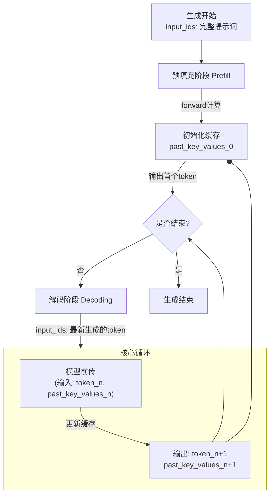

# KV_Cache

由于是推理型，新输入的token只关注前面的token，所有以前的Q就不参与运算了，已经运算完了，因为以前的Q不计算现在新输入的token的q


在 `transformers` 库中（例如使用 `model.generate()` 方法），KV Cache 的运行流程遵循一个清晰的“预填充-解码”两阶段模式，其核心是 `past_key_values`（或 `past_key_value`，单层）这个参数。

------

### 1. 核心数据结构：`past_key_values`

-   **是什么？** 这是一个包含所有 Transformer 层缓存数据的**元组的元组**。
-   **形状**：`(num_layers, 2, batch_size, num_heads, seq_len, head_dim)`
    -   `num_layers`：模型层数。
    -   `2`：第一个元素是当前层 K 的缓存，第二个是 V 的缓存。
    -   在您提供的代码中，`past_key_value` 是单层的，形状为 `(2, batch_size, num_heads, seq_len, head_dim)`。

这个 `past_key_values` 对象会在 `generate()` 函数的每次迭代中被接收、更新并再次传递。

------

### 2. 阶段一：预填充 (Prefill Phase)

**目标**：处理用户输入的提示（Prompt），并初始化 KV Cache。

**流程**：

1.  **输入**：用户输入 `input_ids`（例如 `["人工智能是"]`），`past_key_values` 为 `None`。

2.  **前向传播**：

    -   您的 `forward` 函数被调用，参数 `past_key_value=None`。
    -   代码为**整个提示序列**计算 `xq, xk, xv`。

    python

    ```
    # x 是整个提示 "人工智能是"，seq_len=4
    xq, xk, xv = self.q_proj(x), self.k_proj(x), self.v_proj(x)
    ```

    -   `if past_key_value is not None:` 条件为 `False`，跳过拼接步骤。
    -   因为 `use_cache=True`，函数返回 `past_kv = (xk, xv)`。这个返回值包含了**整个提示**的 K 和 V 状态。

3.  **输出与缓存**：

    -   模型输出最后一个 token (`"是"`) 的隐藏状态，用于预测第一个生成的 token (`"未"`)。
    -   **最重要的是**：所有层的 `past_kv` 被收集起来，形成一个完整的 `past_key_values` 对象。这个对象包含了从第 1 个到第 4 个 token 的所有 K 和 V 的历史信息。

**此阶段结束时的状态**：我们已经有了输出 token `"未"`，并且 KV Cache 已经被正确初始化为 `["人", "工", "智", "能", "是"]` 的所有 K, V。

------

### 3. 阶段二：解码 (Decoding Phase)

**目标**：基于已生成的 token 和 KV Cache，自回归地生成后续的每一个 token。

**流程**（以生成第二个 token `"来"` 为例）：

1.  **输入**：

    -   `input_ids`：不再是整个提示，而是**上一步生成的 token** `"未"`（形状为 `[batch_size, 1]`）。
    -   `past_key_values`：**不再是 None**！它是上一步预填充阶段返回的、包含了 `["人", "工", "智", "能", "是"]` 所有历史信息的缓存对象。

2.  **前向传播 (逐层进行)**：

    -   对于每一层，您的 `forward` 函数被调用，参数 `past_key_value=该层对应的历史缓存`。

    -   代码执行：

        python

        ```
        # x 是当前新输入的单个token "未"，seq_len=1
        xq, xk, xv = self.q_proj(x), self.k_proj(x), self.v_proj(x) # 只计算了"未"的Q,K,V
        ```

        -   `if past_key_value is not None:` 条件为 `True`。

        -   **关键操作**：执行拼接。这是避免重复计算的核心。

            python

            ```
            xk = torch.cat([past_key_value[0], xk], dim=1) # 将历史K与"未"的K拼接
            xv = torch.cat([past_key_value[1], xv], dim=1) # 将历史V与"未"的V拼接
            ```

        -   现在，`xk` 和 `xv` 变成了 `["人", "工", "智", "能", "是", "未"]` 的完整 K 和 V 矩阵。

        -   用**新计算的 `xq`（只对应 token `"未"`）** 和**拼接后的完整 `xk`, `xv`** 计算注意力。这意味着 `"未"` 的表示是通过关注整个历史上下文（包括它自己）计算出来的。

        -   函数返回更新后的 `past_kv = (xk, xv)`，即包含了 `["人", "工", "智", "能", "是", "未"]` 的新缓存。

3.  **输出与缓存更新**：

    -   经过所有层计算后，模型输出 `"未"` 的下一个 token 的预测结果 (`"来"`)。
    -   同样，所有层返回的更新后的 `past_kv` 被收集成新的 `past_key_values` 对象，用于下一步生成。

**循环**：上述解码过程不断重复，每次输入都是最新生成的 token 和上一次的 `past_key_values`，直到生成结束符。

------

### 结合 `transformers` 库的图解流程

下图清晰地展示了 `transformers` 库中 `past_key_values` 在生成过程中的流动与更新机制：




### 总结与您代码的对应关系

| 步骤             | 您代码中的体现                                    | 说明                                                         |
| :--------------- | :------------------------------------------------ | :----------------------------------------------------------- |
| **缓存传入**     | `past_key_value: ... = None` 参数                 | `transformers` 将管理好的缓存传入每一层。                    |
| **缓存读取**     | `if past_key_value is not None:` 后的 `torch.cat` | 从参数中读取历史 K, V 并与当前计算的 K, V 拼接。             |
| **避免重复计算** | `torch.cat([past_key_value[0], xk], dim=1)`       | **历史部分来自参数（缓存）**，**新部分来自当前计算**。完美避免了为历史 token 重新计算 `self.k_proj(x)` 和 `self.v_proj(x)`。 |
| **缓存更新**     | `past_kv = (xk, xv) if use_cache else None`       | 将拼接后的**完整** K, V 返回给 `transformers` 框架，框架会将其作为下一次迭代的输入。 |
| **缓存生命周期** | 由 `transformers` 的 `generate()` 函数管理        | 生成开始时初始化为 `None`，生成过程中持续传递和更新，生成结束后被丢弃。 |

所以，您的理解是正确的：代码确实计算了 `xk` 和 `xv`。但它的精妙之处在于，**在解码阶段，`x` 永远只是单个新 token**，因此这个计算量很小。而历史部分则通过 `past_key_value` 参数“神奇”地提供了，这部分是**零计算成本**的读取操作。这正是 KV Cache 提升推理速度的威力所在。

# Paged Attention

vllm

copy on write

# compile

torch.compile(model)